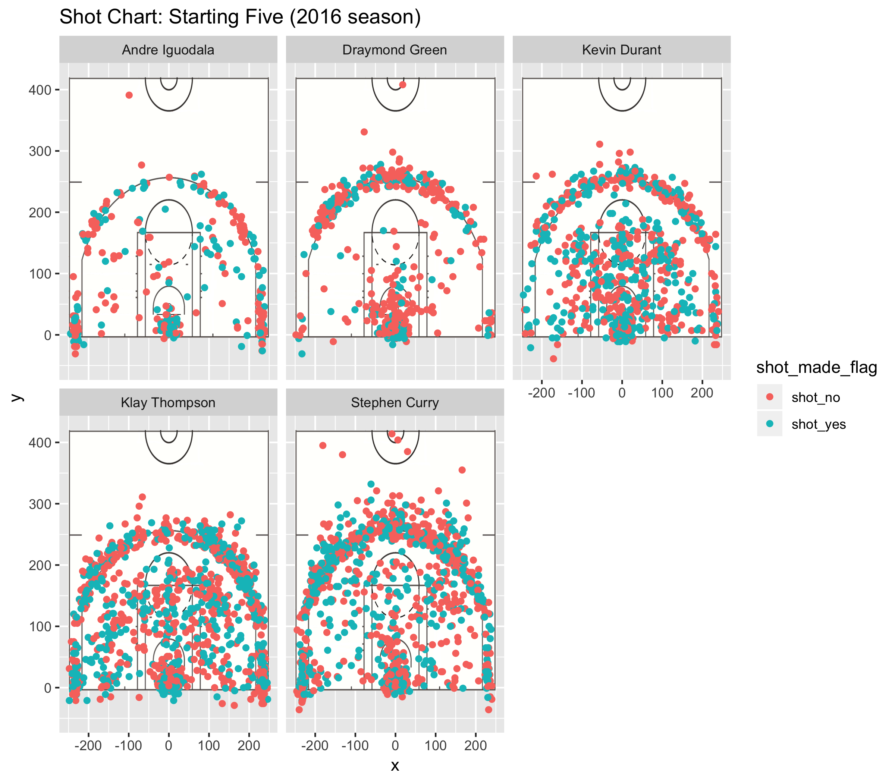

workout01-ryan-chien01.Rmd
================
Ryan Chien

Introduction
------------

The NBA is a constant cycle of dynasties, starting from Bill Russell's Boston Celtics, or Michael Jordan's Chicago Bulls, or Shaquille O'Neal and Kobe Bryant's Los Angeles Lakers. The latest incarnation of this cycle is the Golden State Warriors. For the past 3 to 4 years, the Warriors have dominated the league with a iron fist, accumulating impressive accolades, such the best record in NBA history with a 73-9 record in 2015, as well as Stephen Curry's of 402 3 point field goals in a single season. This is not to mention the 3 NBA championships that they've one in the last 4 seasons. So what is the reason behind their unrivalled success? Most observers will point to the plethora of 3 pointers they take as a team, also noting the efficiency at which they score the 3's. However, some studies suggest that it is perhaps not the 3 pointers, but the 2 point jump shots (a.k.a mid range jump shots) that are the real reason behind their success. In this report, I will dive further into whether or not the Warriors' Effective Shooting Percentage of mid range jump shots is greater than the Effective Shooting Percentage of 3 point jump shots.

Background Info
---------------

Some pertinent info to this experiment would be the shot charts of the Golden State Warriors over a single season. Here is a graphic depicting how the five starters - Andre Iguodala, Draymond Green, Kevin Durant, Klay Thompson, and Stephen Curry - shot charts looked like during the 2016 NBA season:  The 3 point shot is a shot taken outside of the arc, while the midrange shot is a shot taken inside the arc. As you can probably tell, there are many 3 pointers attempted, but there are many mid range shots taken as well. Not only that, but it also appears that there appears to be more percentage of makes in the mid range jump shot area than the 3 point jump shot area. According to Stephen Shea in the article 'Are the Warriors making the Mid-Range relevant again?' mentions that while the rest of the teams in the league are averaging about 16 mid-range jump shots, the Golden State Warriors are averaging 20. The evidence that Shea provides to help his argument is the points per shot (PPS) that the Warriors average on mid range jump shots compared to the rest of the league. On all shots, the Golden State Warriors average 1.21 PPS while all other teams average 1.11 PPS. In contrast, for mid range shots, the Golden State Warriors average 0.94 PPS compared to the rest of the league's 0.79 PPS. He also goes on to mention how Kevin Durant, Stephen Curry, and Klay Thompson all average a significant number of mid range jump shots (this is already fairly evident in the shot chart provided above). Shea ultimately concludes that the Golden State Warriors have become efficient enough at the mid range jump shot that it has opened up all the other spaces of the court (3 pointers and dunks), and this has made it a relevant component of their balanced attack.

Data and Results
----------------

In order to get only the mid range jump shots attempted by the five Golden State Warrior players, I had to first filter out shots with action\_type equal to ‘Jump Shot’ and shot\_type equal to ‘2PT Field Goal’. For the number of made mid range jump shots, I had to additionally filter out the shot\_made\_flag values that were equal to ‘shot\_yes’. Here is the code I used to get the table:

``` r
mid_range_ESP <- arrange(summarise(group_by(shots_data, name), total = sum(shot_type == '2PT Field Goal' & action_type == 'Jump Shot'), made = sum(shot_made_flag == 'shot_yes' & shot_type == '2PT Field Goal' & action_type == 'Jump Shot'), percent_made = made/total), desc(percent_made))
```

And here is the table with the total number of mid range jump shots made, total number of mid range jump shots attempted, and the percent of mid range jump shots made:

``` r
library(readr)
library(dplyr)
```

    ## 
    ## Attaching package: 'dplyr'

    ## The following objects are masked from 'package:stats':
    ## 
    ##     filter, lag

    ## The following objects are masked from 'package:base':
    ## 
    ##     intersect, setdiff, setequal, union

``` r
library(ggplot2)
library(jpeg)
library(grid)
library(knitr)
shots_data <- read.csv('../data/shots-data.csv')
mid_range_ESP <- arrange(summarise(group_by(shots_data, name), total = sum(shot_type == '2PT Field Goal' & action_type == 'Jump Shot'), made = sum(shot_made_flag == 'shot_yes' & shot_type == '2PT Field Goal' & action_type == 'Jump Shot'), percent_made = made/total), desc(percent_made))
kable(mid_range_ESP)
```

| name              |    total|     made|                                                             percent\_made|
|:------------------|--------:|--------:|-------------------------------------------------------------------------:|
| Klay Thompson     |      235|       78|                                                                 0.3319149|
| Kevin Durant      |      145|       48|                                                                 0.3310345|
| Andre Iguodala    |       38|       10|                                                                 0.2631579|
| Stephen Curry     |      115|       26|                                                                 0.2260870|
| Draymond Green    |       52|        4|                                                                 0.0769231|
| Now let's compare |  it to t|  he Effe|  ctive Shooting Percentage of the two pointers, three pointers, and both:|

``` r
two_point_ESP <- arrange(summarise(group_by(shots_data, name), total = sum(shot_type == '2PT Field Goal'), made = sum(shot_made_flag == 'shot_yes' & shot_type == '2PT Field Goal'), percent_made = made/total), desc(percent_made))
kable(two_point_ESP)
```

| name           |  total|  made|  percent\_made|
|:---------------|------:|-----:|--------------:|
| Andre Iguodala |    210|   134|      0.6380952|
| Kevin Durant   |    643|   390|      0.6065319|
| Stephen Curry  |    563|   304|      0.5399645|
| Klay Thompson  |    640|   329|      0.5140625|
| Draymond Green |    346|   171|      0.4942197|

``` r
three_point_ESP <- arrange(summarise(group_by(shots_data, name), total = sum(shot_type == '3PT Field Goal'), made = sum(shot_made_flag == 'shot_yes' & shot_type == '3PT Field Goal'), percent_made = made/total), desc(percent_made))
kable(three_point_ESP)
```

| name           |  total|  made|  percent\_made|
|:---------------|------:|-----:|--------------:|
| Klay Thompson  |    580|   246|      0.4241379|
| Stephen Curry  |    687|   280|      0.4075691|
| Kevin Durant   |    272|   105|      0.3860294|
| Andre Iguodala |    161|    58|      0.3602484|
| Draymond Green |    232|    74|      0.3189655|

``` r
ESP <- arrange(summarise(group_by(shots_data, name), total = sum(shot_type == '2PT Field Goal' | shot_type == '3PT Field Goal'), made = sum(shot_made_flag == 'shot_yes' & (shot_type == '3PT Field Goal' | shot_type == '2PT Field Goal')), percent_made = made/total), desc(percent_made))
kable(ESP)
```

| name           |  total|  made|  percent\_made|
|:---------------|------:|-----:|--------------:|
| Kevin Durant   |    915|   495|      0.5409836|
| Andre Iguodala |    371|   192|      0.5175202|
| Klay Thompson  |   1220|   575|      0.4713115|
| Stephen Curry  |   1250|   584|      0.4672000|
| Draymond Green |    578|   245|      0.4238754|

I think that it is worth noting that Draymond Green and Andre Iguodala take significantly fewer shots than Stephen Curry, Klay Thompson, and Kevin Durant (this is because they play more a defensive role on the Golden State Warriors) as evident with the number shots attempted for both mid range and 3 pointers. It is also worth noting that Draymond Green takes significantly more 3 pointers than mid range jump shots; this was also evident in the initial shot chart shown. The important values that we want are the percent\_made values for the 3 point Effective Shooting Percentage table and the percent\_made values for the mid range Effective Shooting Percentage table. We can see from those values that the Effective Shooting Percentages are actually higher for every player in favor of the 3 point Effective Shooting Percentage. As expected, the biggest drop off in percentage is from Draymond Green. And the smallest difference in percentage is Kevin Durant.

Conclusion
----------

Overall, we can see that the Golden State Warriors are a 3 point shooting juggernaut. Not only do they shoot an unusually large amount of 3 pointers in a season, but they also make them at an equally unusually high rate. While Shea showed that the Golden State Warriors are actually better Points Per Shot wise from the mid range area, they are still more efficient from the 3 point line. However, the Warriors are not solely a 3 point shooting team. As evident with Kevin Durant, he takes 55% of his shots from 3 and 45% of this shots from mid range, which isn’t as staggering as the rest of his teammates. This proves the fact that the Warriors do indeed pose a threat from the mid range jump shot area, and that this leads to the rest of the basketball court to open up and allow for more opportunities to score from other areas. The most profound takeaway from this report is that the Golden State Warriors are simply a very balanced team. Although their speciality is the 3 point jump shot, they can score from other areas almost equally as well, such as the mid range jump shot area. It is because of this that they can take over the league in the most dominant fashion.
